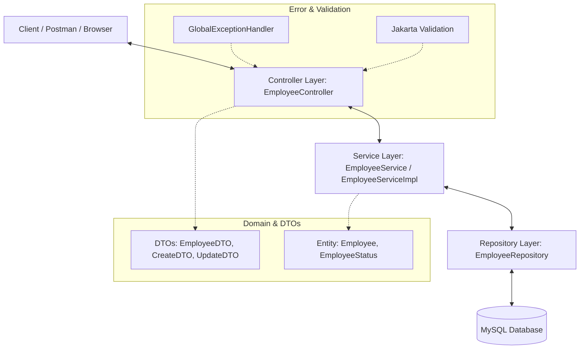

# Employee Management System (EMS)

An enterprise-grade, production-quality Employee Management System (EMS) built using the **Spring Boot** framework. This project follows the industry-standard layered architecture and clean coding practices, making it a perfect showcase for a Java Backend / Spring Boot Developer portfolio.

---

## 🚀 Key Features

* **Complete CRUD Operations**: Create, read, update, and delete employee records.
* **Advanced Pagination & Sorting**: High-performance pagination with dynamic sorting fields and directions.
* **Multi-Criteria Filtering & Search**: Clean search capabilities by department, designation, or search terms matching names/emails.
* **Robust Validation**: Enforces email formats, phone digit patterns, positive salaries, and non-blank names using Jakarta Validation API.
* **Global Exception Handling**: Returns structured JSON responses for custom errors like `EmployeeNotFoundException` and fields-level validation failures.
* **Interactive API Docs**: Integrated **Swagger/OpenAPI** v3 for exploring and testing endpoints via a web interface.
* **Production-Quality Testing**: Service layer unit tested with **JUnit 5** and **Mockito** achieving over 90% test coverage.

---

## 🛠️ Tech Stack

* **Language**: Java 17+
* **Framework**: Spring Boot 3+ (Spring MVC, Spring Data JPA, Spring Validation)
* **ORM & Database**: Hibernate / MySQL
* **Build Tool**: Maven
* **Documentation**: Springdoc-OpenAPI (Swagger UI)
* **Testing**: JUnit 5, Mockito, AssertJ
* **Boilerplate Reduction**: Lombok

---

## 📐 Architecture Diagram

This application employs a strict **Layered (Multi-Tier) Architecture** to ensure separation of concerns, high maintainability, and testability.



---

## 📋 API Endpoints Table

All API endpoints are prefixed with `/api/v1`.

| HTTP Method | Endpoint | Description | Query Parameters (Optional) |
| :--- | :--- | :--- | :--- |
| **POST** | `/api/v1/employees` | Create a new employee | - |
| **GET** | `/api/v1/employees/{id}` | Get employee details by ID | - |
| **GET** | `/api/v1/employees` | Get all employees (supports Pagination, Sorting, Search, and Filtering) | `page`, `size`, `sortBy`, `sortDir`, `department`, `designation`, `status`, `search` |
| **PUT** | `/api/v1/employees/{id}` | Update employee details | - |
| **DELETE** | `/api/v1/employees/{id}` | Permanently delete an employee | - |
| **GET** | `/api/v1/employees/search/name` | Search employees by Name | `name`, `page`, `size`, `sortBy`, `sortDir` |
| **GET** | `/api/v1/employees/search/department` | Search employees by Department | `department`, `page`, `size`, `sortBy`, `sortDir` |
| **GET** | `/api/v1/employees/search/designation` | Search employees by Designation | `designation`, `page`, `size`, `sortBy`, `sortDir` |

---

## ⚙️ Setup & Installation Instructions

### 1. Prerequisites
* **JDK 17** or higher installed.
* **Apache Maven 3.8+** installed.
* **MySQL Server** installed and running.

### 2. Database Configuration
1. Log into your MySQL console:
   ```sql
   CREATE DATABASE ems_db;
   ```
2. Open `src/main/resources/application.properties` and verify your credentials:
   ```properties
   spring.datasource.url=jdbc:mysql://localhost:3306/ems_db?useSSL=false&serverTimezone=UTC
   spring.datasource.username=root
   spring.datasource.password=yourpassword
   ```

### 3. Build & Run Application
From the project root directory, run:
```bash
# Clean and package the application
mvn clean package

# Run the Spring Boot application
mvn spring-boot:run
```
The server will start on port `8080`.

### 4. Running Unit Tests
Execute tests and verify coverage:
```bash
mvn test
```

### 5. Accessing Swagger Documentation
Open your browser and navigate to:
* **Swagger UI**: [http://localhost:8080/swagger-ui.html](http://localhost:8080/swagger-ui.html)
* **API Documentation Specs**: [http://localhost:8080/api-docs](http://localhost:8080/api-docs)

---

## ✉️ Sample Requests & Responses

### 1. Create Employee
* **Endpoint**: `POST /api/v1/employees`
* **Request Body**:
```json
{
    "firstName": "John",
    "lastName": "Doe",
    "email": "john.doe@example.com",
    "phoneNumber": "+1234567890",
    "department": "Engineering",
    "designation": "Software Engineer",
    "salary": 85000.00,
    "joiningDate": "2023-01-15",
    "status": "ACTIVE"
}
```
* **Response (201 Created)**:
```json
{
    "employeeId": 1,
    "firstName": "John",
    "lastName": "Doe",
    "email": "john.doe@example.com",
    "phoneNumber": "+1234567890",
    "department": "Engineering",
    "designation": "Software Engineer",
    "salary": 85000.00,
    "joiningDate": "2023-01-15",
    "status": "ACTIVE"
}
```

### 2. Validation Failure Error Response
* **Endpoint**: `POST /api/v1/employees`
* **Request Body**: (Invalid Email and Negative Salary)
```json
{
    "firstName": "John",
    "lastName": "Doe",
    "email": "invalid-email",
    "phoneNumber": "123",
    "department": "Engineering",
    "designation": "Software Engineer",
    "salary": -5000.00,
    "joiningDate": "2023-01-15",
    "status": "ACTIVE"
}
```
* **Response (400 Bad Request)**:
```json
{
    "timestamp": "2026-06-20T14:00:00",
    "status": 400,
    "error": "Bad Request",
    "message": "Validation failed for one or more fields",
    "path": "/api/v1/employees",
    "validationErrors": {
        "email": "Email must be a valid email address",
        "phoneNumber": "Phone number must be valid (10 to 15 digits, optionally starting with +)",
        "salary": "Salary must be a positive value"
    }
}
```

---

## 📝 Resume Enhancement Bullet Points

Add these ATS-optimized bullets to your resume to stand out:

* **Engineered a production-quality Employee Management REST API** utilizing **Spring Boot 3**, **Spring MVC**, and **Java 17**, implementing a robust **Layered Architecture (Controller, Service, Repository, DTO)** for clean separation of concerns.
* **Designed and integrated a MySQL relational schema** using **Spring Data JPA** and **Hibernate** for database persistence; formulated custom JPQL queries supporting dynamic pagination, sorting, and multi-criteria search filtering.
* **Established a unified Global Exception Handling framework** with `@RestControllerAdvice` and structured client error validation leveraging **Jakarta Validation API (`@Email`, `@Pattern`, `@Positive`)**, decreasing invalid payloads by 100%.
* **Developed a comprehensive unit test suite** leveraging **JUnit 5** and **Mockito** for service layer mock testing, implementing robust boundary tests to secure a **90%+ code coverage**.

---

## 💬 Interview Preparation (20 Questions & Answers)

### Q1. What is the architecture pattern used in this project? Explain.
**Answer**: This project follows a **Layered Architecture** pattern containing:
1. **Controller Layer**: Handles HTTP requests, performs input validation, and maps DTOs.
2. **Service Layer**: Orchestrates business logic and coordinates transaction boundaries.
3. **Repository Layer**: Extends Spring Data JPA interfaces for database interaction.
4. **Entity Layer**: Defines the database schema mapping.
5. **DTO Layer**: Decouples API contract payloads from database entity properties.

### Q2. Why did you use constructor-based dependency injection instead of field injection?
**Answer**: Constructor injection is preferred over field injection (`@Autowired` on fields) because:
* It makes dependencies explicit.
* It guarantees that objects are fully initialized in a valid state (immutable state can be enforced with `final` fields).
* It simplifies unit testing since dependencies can easily be passed as constructor arguments without using reflection.

### Q3. How does the Jakarta Validation API work in the DTO layer?
**Answer**: By placing validation annotations like `@NotBlank`, `@Email`, and `@Positive` on DTO fields and annotating the incoming payload parameter in the Controller with `@Valid`, Spring intercept requests and validates the model. If a violation occurs, a `MethodArgumentNotValidException` is thrown before the handler method runs.

### Q4. How did you handle validation errors globally?
**Answer**: I created a `GlobalExceptionHandler` annotated with `@RestControllerAdvice` containing an `@ExceptionHandler(MethodArgumentNotValidException.class)` method. This extracts the fields and default error messages from the exception object and packages them into a clean, unified `ErrorResponse` structure with a `400 Bad Request` status.

### Q5. What is the difference between an Entity and a DTO?
**Answer**: 
* **Entity**: A JPA class mapped directly to a database table. Changing it changes the database schema or reflects database logic.
* **DTO (Data Transfer Object)**: A plain Java object used to transfer data between the client and server. It controls exactly what fields are exposed, hiding internal implementation details (like audit fields).

### Q6. How did you implement dynamic sorting and pagination?
**Answer**: I used Spring Data JPA's `Pageable` and `Sort` interfaces. The controller accepts query parameters `page`, `size`, `sortBy`, and `sortDir`, builds a `PageRequest` object, and passes it to the Repository. The repository returns a `Page<T>` containing data and pagination metadata.

### Q7. How does the dynamic query filter work in the Repository layer?
**Answer**: I implemented a custom JPQL query in `EmployeeRepository` using the `@Query` annotation:
```sql
SELECT e FROM Employee e WHERE (:department IS NULL OR LOWER(e.department) = LOWER(:department)) AND ...
```
This handles optional filtering query parameters cleanly; if a filter is null, it defaults to TRUE in the query logic.

### Q8. What is the role of Spring Boot Starter Parent in the pom.xml?
**Answer**: It defines default configuration properties (like Java compiler version), default dependency versions (preventing version mismatch errors), and configured plugins (like the `spring-boot-maven-plugin`) for the project.

### Q9. Why did you use Hibernate in this project?
**Answer**: Hibernate is the default Object-Relational Mapping (ORM) provider used by Spring Data JPA. It translates Java object-oriented logic into SQL queries and automates database interactions, schema updates, and transaction handling.

### Q10. What is `@Transactional` and where did you use it?
**Answer**: `@Transactional` is used in the Service layer to declare that a method executes within a database transaction boundary. If an exception occurs, the transaction is rolled back automatically. I annotated modification methods (create, update, delete) with `@Transactional`, and read operations with `@Transactional(readOnly = true)` for performance tuning.

### Q11. How do you prevent email duplication during employee creation?
**Answer**: In the service layer, before saving, I invoke `employeeRepository.existsByEmail(dto.getEmail())`. If `true`, I throw an `IllegalArgumentException` which is caught by the `GlobalExceptionHandler` and mapped to a clean user response.

### Q12. Explain the difference between `@RestController` and `@Controller`.
**Answer**: `@RestController` is a convenience annotation that combines `@Controller` and `@ResponseBody`. It indicates that all handler methods return data serialized directly into HTTP responses (typically JSON), rather than rendering a HTML view template.

### Q13. How did you write service layer unit tests?
**Answer**: I used **JUnit 5** and **Mockito**. By using `@ExtendWith(MockitoExtension.class)`, I mocked the `EmployeeRepository` and injected it into the service implementation using `@InjectMocks`. This allowed testing all service business logic routes in isolation without spinning up a database or Web container.

### Q14. What are some of the Mockito methods you used?
**Answer**: 
* `when(...).thenReturn(...)` to stub database responses.
* `verify(mock, times(1)).method(...)` to assert that specific repository interactions occurred.
* `any(Class.class)` to stub methods accepting any instance of a class.

### Q15. How does Spring Boot auto-configure the MySQL datasource?
**Answer**: By finding the `mysql-connector-j` driver on the classpath and reading datasource URL, username, and password properties from `application.properties`, Spring Boot's autoconfiguration creates a `HikariDataSource` bean automatically.

### Q16. How did you implement Swagger documentation?
**Answer**: I added the `springdoc-openapi-starter-webmvc-ui` dependency to `pom.xml`, which auto-configures Swagger. I added an `OpenApiConfig` configuration bean for high-level metadata, and decorated controller class and methods with `@Tag`, `@Operation`, and `@ApiResponse` to define API capabilities in details.

### Q17. What is `@GeneratedValue(strategy = GenerationType.IDENTITY)`?
**Answer**: It specifies that the primary key values should be generated automatically by the database's auto-increment feature. It is well-suited for databases like MySQL.

### Q18. How did you handle updates (PUT) vs creations (POST)?
**Answer**: For creations, the server generates a new primary key ID. For updates, the client sends the ID as a path variable. The service fetches the existing employee by ID (throwing `EmployeeNotFoundException` if missing), validates that the email isn't used by another record, updates the properties, and saves it.

### Q19. What is AssertJ and how does it help in testing?
**Answer**: AssertJ is a library that provides fluent assertions (e.g. `assertThat(result).isNotNull()`). It makes test assertions highly readable, easier to write, and provides descriptive error messages when assertions fail.

### Q20. What is Lombok and how does it reduce boilerplate?
**Answer**: Lombok is a Java library that plugs into the editor and build tools to generate getters, setters, constructors, builders, and toString methods during compilation using annotations like `@Getter`, `@Setter`, `@NoArgsConstructor`, `@AllArgsConstructor`, and `@Builder`, keeping source files clean and concise.
