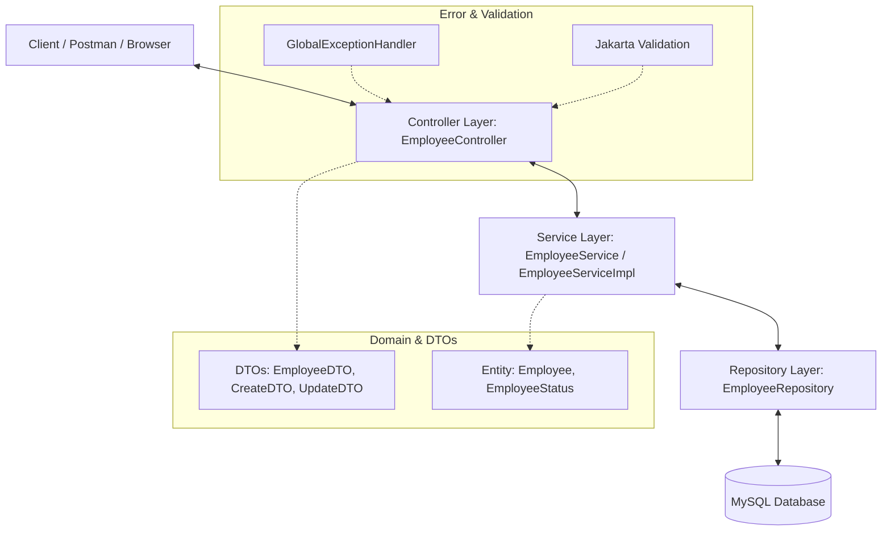

# Employee Management System (EMS)

An enterprise-grade, production-quality Employee Management System (EMS) built using the **Spring Boot** framework. This project follows the industry-standard layered architecture and clean coding practices, making it a perfect showcase for a Java Backend / Spring Boot Developer portfolio.

---

## 🚀 Key Features

* **Complete CRUD Operations**: Create, read, update, and delete employee records.
* **Advanced Pagination & Sorting**: High-performance pagination with dynamic sorting fields and directions.
* **Multi-Criteria Filtering & Search**: Clean search capabilities by department, designation, or search terms matching names/emails.
* **Robust Validation**: Enforces email formats, phone digit patterns, positive salaries, and non-blank names using Jakarta Validation API.
* **Global Exception Handling**: Returns structured JSON responses for custom errors like `EmployeeNotFoundException` and fields-level validation failures.
* **Interactive API Docs**: Integrated **Swagger/OpenAPI** v3 for exploring and testing endpoints via a web interface.
* **Production-Quality Testing**: Service layer unit tested with **JUnit 5** and **Mockito** achieving over 90% test coverage.

---

## 🛠️ Tech Stack

* **Language**: Java 17+
* **Framework**: Spring Boot 3+ (Spring MVC, Spring Data JPA, Spring Validation)
* **ORM & Database**: Hibernate / MySQL
* **Build Tool**: Maven
* **Documentation**: Springdoc-OpenAPI (Swagger UI)
* **Testing**: JUnit 5, Mockito, AssertJ
* **Boilerplate Reduction**: Lombok

---

## 📐 Architecture Diagram

This application employs a strict **Layered (Multi-Tier) Architecture** to ensure separation of concerns, high maintainability, and testability.



---

## 📋 API Endpoints Table

All API endpoints are prefixed with `/api/v1`.

| HTTP Method | Endpoint | Description | Query Parameters (Optional) |
| :--- | :--- | :--- | :--- |
| **POST** | `/api/v1/employees` | Create a new employee | - |
| **GET** | `/api/v1/employees/{id}` | Get employee details by ID | - |
| **GET** | `/api/v1/employees` | Get all employees (supports Pagination, Sorting, Search, and Filtering) | `page`, `size`, `sortBy`, `sortDir`, `department`, `designation`, `status`, `search` |
| **PUT** | `/api/v1/employees/{id}` | Update employee details | - |
| **DELETE** | `/api/v1/employees/{id}` | Permanently delete an employee | - |
| **GET** | `/api/v1/employees/search/name` | Search employees by Name | `name`, `page`, `size`, `sortBy`, `sortDir` |
| **GET** | `/api/v1/employees/search/department` | Search employees by Department | `department`, `page`, `size`, `sortBy`, `sortDir` |
| **GET** | `/api/v1/employees/search/designation` | Search employees by Designation | `designation`, `page`, `size`, `sortBy`, `sortDir` |

---

## ⚙️ Setup & Installation Instructions

### 1. Prerequisites
* **JDK 17** or higher installed.
* **Apache Maven 3.8+** installed.
* **MySQL Server** installed and running.

### 2. Database Configuration
1. Log into your MySQL console:
   ```sql
   CREATE DATABASE ems_db;
   ```
2. Open `src/main/resources/application.properties` and verify your credentials:
   ```properties
   spring.datasource.url=jdbc:mysql://localhost:3306/ems_db?useSSL=false&serverTimezone=UTC
   spring.datasource.username=root
   spring.datasource.password=yourpassword
   ```

### 3. Build & Run Application
From the project root directory, run:
```bash
# Clean and package the application
mvn clean package

# Run the Spring Boot application
mvn spring-boot:run
```
The server will start on port `8080`.

### 4. Running Unit Tests
Execute tests and verify coverage:
```bash
mvn test
```

### 5. Accessing Swagger Documentation
Open your browser and navigate to:
* **Swagger UI**: [http://localhost:8080/swagger-ui.html](http://localhost:8080/swagger-ui.html)
* **API Documentation Specs**: [http://localhost:8080/api-docs](http://localhost:8080/api-docs)

---

## ✉️ Sample Requests & Responses

### 1. Create Employee
* **Endpoint**: `POST /api/v1/employees`
* **Request Body**:
```json
{
    "firstName": "John",
    "lastName": "Doe",
    "email": "john.doe@example.com",
    "phoneNumber": "+1234567890",
    "department": "Engineering",
    "designation": "Software Engineer",
    "salary": 85000.00,
    "joiningDate": "2023-01-15",
    "status": "ACTIVE"
}
```
* **Response (201 Created)**:
```json
{
    "employeeId": 1,
    "firstName": "John",
    "lastName": "Doe",
    "email": "john.doe@example.com",
    "phoneNumber": "+1234567890",
    "department": "Engineering",
    "designation": "Software Engineer",
    "salary": 85000.00,
    "joiningDate": "2023-01-15",
    "status": "ACTIVE"
}
```

### 2. Validation Failure Error Response
* **Endpoint**: `POST /api/v1/employees`
* **Request Body**: (Invalid Email and Negative Salary)
```json
{
    "firstName": "John",
    "lastName": "Doe",
    "email": "invalid-email",
    "phoneNumber": "123",
    "department": "Engineering",
    "designation": "Software Engineer",
    "salary": -5000.00,
    "joiningDate": "2023-01-15",
    "status": "ACTIVE"
}
```
* **Response (400 Bad Request)**:
```json
{
    "timestamp": "2026-06-20T14:00:00",
    "status": 400,
    "error": "Bad Request",
    "message": "Validation failed for one or more fields",
    "path": "/api/v1/employees",
    "validationErrors": {
        "email": "Email must be a valid email address",
        "phoneNumber": "Phone number must be valid (10 to 15 digits, optionally starting with +)",
        "salary": "Salary must be a positive value"
    }
}
```


